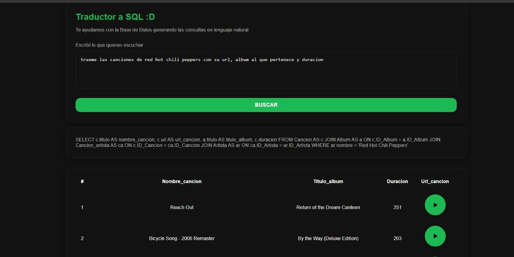
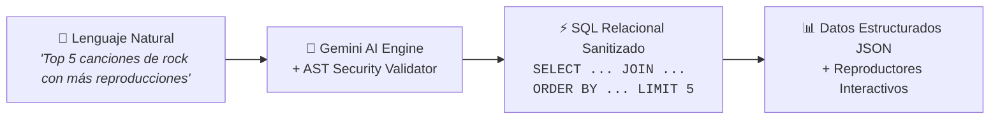
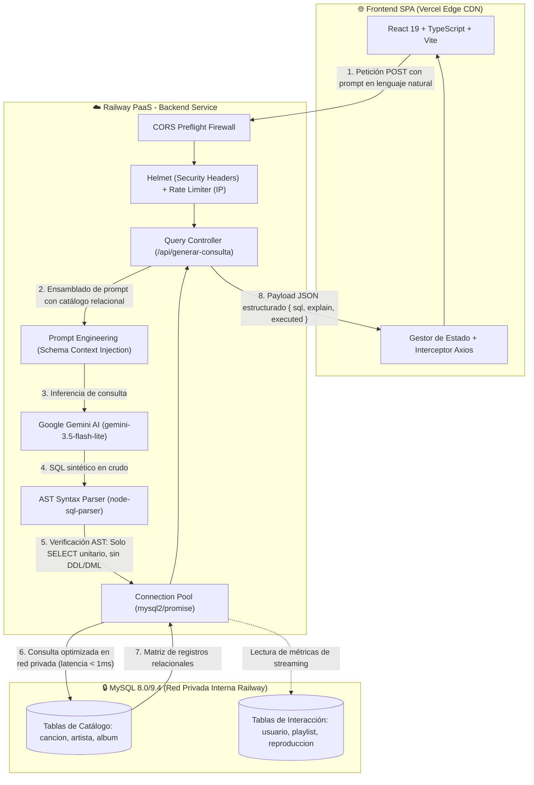
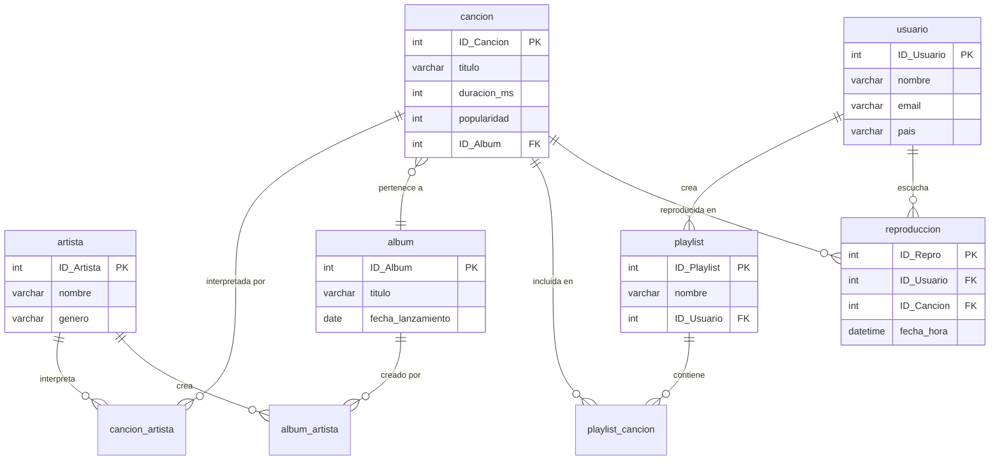
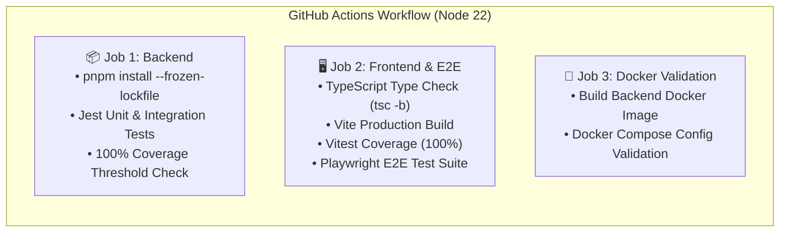

<div align="center">

  

  # SQLify
  ### *Traductor Inteligente de Lenguaje Natural a Consultas SQL para Catálogo Musical*

  [](https://github.com/JulianBarberis/SQLify/actions/workflows/ci.yml)
  [](https://github.com/JulianBarberis/SQLify)
  [](https://nodejs.org/)
  [](https://react.dev/)
  [](https://www.mysql.com/)
  [](https://opensource.org/licenses/ISC)
  [](https://sq-lify-sandy.vercel.app)
  [](https://sqlify-production-44bf.up.railway.app)

  <br />

  <p align="center">
    <a href="https://sq-lify-sandy.vercel.app" target="_blank">
      
    </a>
    <a href="https://sqlify-production-44bf.up.railway.app/api" target="_blank">
      
    </a>
    <a href="https://www.canva.com/design/DAG4DoByMzI/3HBdtNNOGrPtjUhFCQqehA/edit" target="_blank">
      
    </a>
    <a href="https://docs.google.com/document/d/1xCTAz2p39cdZCyoZAtHQ-RzSXuyHwVRB9p9WoXEulsA/edit?tab=t.0#heading=h.lkn6otcsxfke" target="_blank">
      
    </a>
  </p>

</div>

---

## 📋 Tabla de Contenidos

1. [Propuesta de Valor y Demostración en Vivo](#-propuesta-de-valor-y-demostración-en-vivo)
2. [Arquitectura del Sistema](#-arquitectura-del-sistema)
3. [Pilares Técnicos y Hardening de Seguridad](#-pilares-técnicos-y-hardening-de-seguridad)
4. [Esquema de Base de Datos y Poblado](#-esquema-de-base-de-datos-y-poblado)
5. [Guía de Instalación y Uso Local (Quickstart)](#-guía-de-instalación-y-uso-local-quickstart)
6. [Estructura del Repositorio (Monorepo Map)](#-estructura-del-repositorio-monorepo-map)
7. [Pipeline de CI/CD y Estrategia de Testing](#-pipeline-de-cicd-y-estrategia-de-testing)
8. [Despliegue en la Nube (Producción)](#-despliegue-en-la-nube-producción)
9. [Variables de Entorno](#-variables-de-entorno)
10. [Licencia](#-licencia)

---

## 💡 Propuesta de Valor y Demostración en Vivo

La extracción de métricas, análisis de tendencias y exploración de catálogos relacionales de música tradicionalmente exige redactar sentencias complejas con múltiples `JOIN`, cláusulas de agregación y subconsultas. **SQLify** derriba esta barrera técnica integrando **Google Gemini AI** con un motor relacional **MySQL** sobre un catálogo a escala real de Spotify (+12.000 canciones, +2.000 álbumes y +300 artistas).

A través de una interfaz interactiva de alta fidelidad construida en React 19, cualquier usuario puede ingresar consultas cotidianas en español o inglés y recibir al instante tanto la sentencia SQL generada de manera determinista como la ejecución en vivo contra la base de datos, acompañada de previsualizaciones auditivas y reproductores interactivos.

<div align="center">
  
</div>

<br />

### 🔄 Transformación: Antes / Después



#### 1. Entrada (Lenguaje Natural)
> *"Top 10 canciones más reproducidas de Queen"*

#### 2. Consulta SQL Generada y Sanitizada
```sql
SELECT c.titulo, a.nombre AS artista, COUNT(r.ID_Repro) AS total_reproducciones
FROM cancion c
JOIN cancion_artista ca ON c.ID_Cancion = ca.ID_Cancion
JOIN artista a ON ca.ID_Artista = a.ID_Artista
JOIN reproduccion r ON c.ID_Cancion = r.ID_Cancion
WHERE a.nombre LIKE '%Queen%'
GROUP BY c.ID_Cancion, c.titulo, a.nombre
ORDER BY total_reproducciones DESC
LIMIT 10;
```

#### 3. Salida de la API (`POST /api/generar-consulta`)
```json
{
  "sql": "SELECT c.titulo, a.nombre AS artista, COUNT(r.ID_Repro) AS total_reproducciones FROM cancion c JOIN cancion_artista ca ON c.ID_Cancion = ca.ID_Cancion JOIN artista a ON ca.ID_Artista = a.ID_Artista JOIN reproduccion r ON c.ID_Cancion = r.ID_Cancion WHERE a.nombre LIKE '%Queen%' GROUP BY c.ID_Cancion, c.titulo, a.nombre ORDER BY total_reproducciones DESC LIMIT 10",
  "explain": "Consulta SQL generada por GeminiAPI y validada con Abstract Syntax Tree (AST).",
  "executed": {
    "rowCount": 10,
    "rows": [
      {
        "titulo": "Bohemian Rhapsody",
        "artista": "Queen",
        "total_reproducciones": 48
      },
      {
        "titulo": "Don't Stop Me Now",
        "artista": "Queen",
        "total_reproducciones": 36
      }
    ]
  }
}
```

---

## 🏛️ Arquitectura del Sistema

El flujo de información implementa un esquema **Zero-Trust SQL Execution**: el código SQL devuelto por el modelo generativo jamás se ejecuta de forma directa en el motor sin antes pasar por validadores sintácticos estrictos en memoria.



### Componentes de la Arquitectura

| Capa | Tecnologías | Responsabilidad Principal |
| :--- | :--- | :--- |
| **Frontend SPA** | React 19, TypeScript, Vite, CSS Modules | Interfaz de usuario reactiva, renderizado de tablas dinámicas, reproductores de audio, toasts de notificación y accesibilidad. |
| **API Gateway** | Node.js 22, Express 5, Helmet, CORS | Control de acceso por IP, cabeceras seguras CSP/HSTS, negociación preflight CORS estricta y ruteo centralizado. |
| **Motor de Inferencia** | `@google/generative-ai` (`gemini-3.5-flash-lite`) | Comprensión del lenguaje natural, extracción semántica de entidades musicales y traducción al dialecto relacional de MySQL. |
| **Filtro de Seguridad AST** | `node-sql-parser` | Análisis sintáctico estricto en árbol (AST). Garantiza ejecución exclusiva de consultas `SELECT` y bloquea inyecciones o mutaciones. |
| **Capa de Persistencia** | MySQL 8.0/9.4, `mysql2/promise` | Pool de conexiones persistentes con reconexión elástica, soporte SSL/TLS en la nube y ejecución relacional de alto rendimiento. |

---

## 🛡️ Pilares Técnicos y Hardening de Seguridad

> [!IMPORTANT]
> Los modelos de lenguaje grande (LLMs) son generadores de texto probabilísticos. SQLify aplica un modelo de defensa en profundidad para garantizar que ninguna respuesta maliciosa, alucinada o manipulada afecte la integridad de la base de datos.

```
                  ┌────────────────────────────────────────────────────────┐
                  │                 Petición Entrante HTTP                 │
                  └───────────────────────────┬────────────────────────────┘
                                              ▼
                  ┌────────────────────────────────────────────────────────┐
                  │ 1. Rate Limiting por IP (100 req/min, 30 req/min API)   │
                  └───────────────────────────┬────────────────────────────┘
                                              ▼
                  ┌────────────────────────────────────────────────────────┐
                  │ 2. Cabeceras Seguras Helmet + CORS Origin Whitelist    │
                  └───────────────────────────┬────────────────────────────┘
                                              ▼
                  ┌────────────────────────────────────────────────────────┐
                  │ 3. Inferencia Gemini con Prompt Engineering Blindado   │
                  └───────────────────────────┬────────────────────────────┘
                                              ▼
                  ┌────────────────────────────────────────────────────────┐
                  │ 4. Validación AST: ¿Tipo SELECT? ¿Una sola consulta?   │
                  └───────────────────────────┬────────────────────────────┘
                                              ▼  (Aprobado)
                  ┌────────────────────────────────────────────────────────┐
                  │ 5. Ejecución en MySQL Read-Only Connection Pool        │
                  └────────────────────────────────────────────────────────┘
```

### 1. Validación Estricta por AST (Abstract Syntax Tree)
A través de `node-sql-parser`, la consulta generada es descompuesta en su árbol de sintaxis abstracta:
- **Solo `SELECT`:** Cualquier sentencia DML (`INSERT`, `UPDATE`, `DELETE`) o DDL (`DROP`, `ALTER`, `CREATE`, `TRUNCATE`) es interceptada y rechazada antes de tocar la base de datos arrojando un código de error controlado.
- **Prevención de Stacked Queries:** Se prohíbe la concatenación de múltiples consultas mediante punto y coma (`;`).
- **Sanitización de Salida:** Los bloques de Markdown (` ```sql `) son limpiados automáticamente mediante expresiones regulares antes del análisis sintáctico.

### 2. Rate Limiting y Prevención de Abuso
- **Límite Global:** 100 peticiones por ventana de 15 minutos por dirección IP.
- **Límite de Inferencia (`/api/generar-consulta`):** 30 solicitudes por minuto por IP para mitigar costos y evitar saturación en la cuota de Google Gemini.

### 3. Normalización y Resiliencia Multiplataforma
- **Case-Sensitivity Linux:** En servidores de producción Linux, MySQL distingue mayúsculas y minúsculas por defecto (`lower_case_table_names=0`). SQLify normaliza el nombre de todas las tablas en minúsculas en el modelo relacional y fuerza la correspondencia en los scripts de autoseeding.
- **Soporte Híbrido de Credenciales:** El backend detecta variables locales estándar (`DB_HOST`, `DB_PORT`, `DB_USER`) y variables nativas de plataformas cloud como Railway (`MYSQLHOST`, `MYSQLPORT`, `MYSQLUSER`, `MYSQLDATABASE`, `DATABASE_PUBLIC_URL`).
- **Seguridad en Tránsito (SSL/TLS):** Soporte automático para canales cifrados SSL exigidos por proveedores cloud.

---

## 🗄️ Esquema de Base de Datos y Poblado

El esquema relacional modela fielmente la arquitectura de datos de streaming musical:



### Auto-seeding Inteligente
Al arrancar el servidor backend (`backend/src/index.js`), el sistema verifica la existencia de datos en la tabla `cancion`. Si la base de datos está vacía, dispara automáticamente la secuencia de inicialización:
1. **Catálogo Maestro:** Ejecuta `dump.sql` cargando más de 12.000 canciones, 2.000 álbumes y 300 artistas internacionales.
2. **Generación de Usuarios Ficticios:** Crea 50 usuarios sintéticos distribuidos globalmente utilizando `@faker-js/faker`.
3. **Playlists Temáticas:** Crea 20 playlists aleatorias asociando entre 10 y 30 canciones por lista.
4. **Historial de Streaming:** Genera 2.500 registros de eventos de reproducción con distribución temporal realista para habilitar consultas de popularidad y analítica.

> [!TIP]
> También puedes ejecutar o forzar el poblado manualmente en cualquier momento mediante el comando:
> ```bash
> pnpm --filter ./backend run db:seed
> ```

---

## 🚀 Guía de Instalación y Uso Local (Quickstart)

### Prerrequisitos
- **Node.js**: Versión 22.x o superior ([Descargar](https://nodejs.org/))
- **pnpm**: Versión 11.x o superior (`npm install -g pnpm`)
- **Docker y Docker Compose**: (Opcional, para ejecución en contenedores)
- **API Key de Google Gemini**: Obtenible gratis en [Google AI Studio](https://aistudio.google.com/)

---

### Opción 1: Ejecución Nativa con `pnpm`

1. **Clonar el Repositorio:**
   ```bash
   git clone https://github.com/JulianBarberis/SQLify.git
   cd SQLify
   ```

2. **Instalar Dependencias en el Monorepo:**
   ```bash
   pnpm install
   ```

3. **Configurar Variables de Entorno:**
   ```bash
   # Configuración del Backend
   cp backend/.env.example backend/.env

   # Configuración del Frontend
   cp frontend/.env.example frontend/.env
   ```
   Edita `backend/.env` e introduce tu clave `GEMINI_API_KEY` y los accesos a tu instancia MySQL local.

4. **Inicializar la Base de Datos:**
   Asegúrate de que tu servicio MySQL local esté corriendo y ejecuta:
   ```bash
   pnpm --filter ./backend run db:seed
   ```

5. **Iniciar los Servicios de Desarrollo:**
   En terminales separadas (o en paralelo):
   ```bash
   # Terminal 1: Backend Express (puerto 3001)
   pnpm --filter ./backend run dev

   # Terminal 2: Frontend Vite (puerto 5173)
   pnpm --filter ./frontend run dev
   ```
   Abre [http://localhost:5173](http://localhost:5173) en tu navegador.

---

### Opción 2: Ejecución Completa con Docker Compose

La forma más rápida de levantar todo el ecosistema (MySQL 8.0, Backend Express y Frontend Vite) sin instalar bases de datos locales:

1. **Preparar el entorno Docker:**
   ```bash
   cp .env.docker.example .env
   ```
   Edita el archivo `.env` en la raíz e ingresa tu `GEMINI_API_KEY`.

2. **Levantar los Contenedores:**
   ```bash
   docker compose up --build
   ```

3. **Acceder a los Servicios:**
   - **Frontend:** [http://localhost:5173](http://localhost:5173)
   - **Backend API:** [http://localhost:3001/api](http://localhost:3001/api)
   - **MySQL:** Puerto `3306` mapeado en tu localhost.

---

## 📂 Estructura del Repositorio (Monorepo Map)

```text
SQLify/
├── .github/
│   └── workflows/
│       └── ci.yml               # Pipeline de CI (3 jobs: Backend, Frontend, Docker)
├── backend/
│   ├── Dockerfile               # Construcción multi-stage (dev / production)
│   ├── src/
│   │   ├── __tests__/           # Suite de pruebas Jest (100% Cobertura)
│   │   ├── controllers/         # Lógica de controladores (queryController, healthcheck)
│   │   ├── db/                  # Pool de conexiones MySQL y scripts de datos
│   │   │   └── scripts/         # dump.sql, seed.js, generadores con Faker
│   │   ├── middlewares/         # Helmet, CORS estricto, Rate Limiter, Error Handler
│   │   ├── routes/              # Definición de endpoints (/api)
│   │   ├── spotify/             # Cliente e integración con API externa de Spotify
│   │   ├── utils/               # Prompts de Gemini y validador sintáctico AST
│   │   ├── app.js               # Ensamblado de Express, middlewares y rutas
│   │   └── index.js             # Punto de entrada HTTP y auto-seeding
│   ├── package.json             # Dependencias de backend y configuración de Jest
│   └── .env.example             # Plantilla de variables para backend
├── frontend/
│   ├── Dockerfile               # Multi-stage Docker (Vite dev / Nginx production)
│   ├── tests/                   # Pruebas End-to-End con Playwright
│   ├── src/
│   │   ├── assets/              # Identidad visual, logos y capturas de pantalla
│   │   ├── components/          # Componentes React (Editor, Resultados, Reproductores)
│   │   ├── models/              # Contratos e interfaces de TypeScript
│   │   ├── service/             # Cliente Axios y llamadas tipadas a la API
│   │   ├── test/                # Setup de pruebas para Vitest y Testing Library
│   │   ├── App.tsx              # Componente principal de la interfaz
│   │   └── main.tsx             # Punto de montaje React 19
│   ├── package.json             # Dependencias de frontend y scripts de Vitest/Playwright
│   └── .env.example             # Plantilla de variables para frontend
├── docker-compose.yml           # Orquestación de servicios en modo desarrollo
├── docker-compose.prod.yml      # Configuración de límites y hardening para producción
├── pnpm-workspace.yaml          # Declaración de paquetes del monorepo
├── vercel.json                  # Reglas de enrutamiento SPA para Vercel Edge
├── DEPLOYMENT.md                # Manual detallado de despliegue paso a paso
└── README.md                    # Documentación técnica principal del proyecto
```

---

## 🧪 Pipeline de CI/CD y Estrategia de Testing

El proyecto cuenta con una política estricta de **100% de Cobertura de Código** y verificación continua en cada Pull Request a las ramas `main` y `dev`.

### Comandos de Testing

```bash
# Ejecutar pruebas unitarias e integración de Backend con reporte de cobertura (Jest)
pnpm --filter ./backend run test:coverage

# Ejecutar pruebas unitarias y de componentes de Frontend (Vitest)
pnpm --filter ./frontend run test:coverage

# Ejecutar pruebas End-to-End en navegadores headless (Playwright)
pnpm --filter ./frontend run test:e2e
```

### Flujo de Integración Continua (`.github/workflows/ci.yml`)

El pipeline automatizado en GitHub Actions ejecuta 3 trabajos en paralelo sobre contenedores `ubuntu-latest`:



1. **`backend` (Backend Tests & Coverage):**
   - Configuración de Node.js 22 y pnpm con caché determinista.
   - Ejecución de Jest en modo ESM (`--experimental-vm-modules`).
   - Verificación de umbral del **100%** en `statements`, `branches`, `functions` y `lines`.
2. **`frontend` (Frontend Build, Coverage & E2E):**
   - Verificación estricta de tipos en TypeScript (`tsc -b`).
   - Compilación para producción con Vite (`vite build`).
   - Ejecución de pruebas con Vitest y reporte de cobertura V8 al **100%**.
   - Instalación de Chromium con dependencias del sistema y ejecución de suite E2E con **Playwright**.
3. **`docker` (Docker Build & Compose Validation):**
   - Construcción de la imagen Docker de backend mediante Buildx.
   - Validación sintáctica de la topología de contenedores (`docker compose config`).

---

## ☁️ Despliegue en la Nube (Producción)

SQLify opera bajo una arquitectura distribuida optimizada para rendimiento y costos:

```
                  ┌──────────────────────────────────────────────┐
                  │              Vercel Edge Network             │
                  │        Single Page Application (SPA)         │
                  │      https://sq-lify-sandy.vercel.app        │
                  └──────────────────────┬───────────────────────┘
                                         │ HTTPS Requests (CORS)
                                         ▼
                  ┌──────────────────────────────────────────────┐
                  │                 Railway PaaS                 │
                  │         Servicio API REST (Node 22)          │
                  │   https://sqlify-production-44bf.up.railway.app│
                  └──────────────────────┬───────────────────────┘
                                         │ Red Privada Interna (<1ms)
                                         ▼
                  ┌──────────────────────────────────────────────┐
                  │            Railway Managed MySQL             │
                  │          MySQL 8.0 / Volumen 10 GB           │
                  └──────────────────────────────────────────────┘
```

- **Frontend (Vercel):**
  Desplegado en el CDN global de Vercel. El archivo [`vercel.json`](./vercel.json) reescribe todas las rutas al `index.html` para soportar navegación del lado del cliente.
- **Backend y Base de Datos (Railway):**
  El backend corre en un contenedor Docker con Node.js 22 conectado a una base de datos MySQL 8.0 alojada en la misma red privada de Railway, garantizando latencias menores a 1 milisegundo en la ejecución de consultas.

> [!NOTE]
> Para instrucciones detalladas paso a paso sobre cómo aprovisionar y desplegar tus propias instancias en Vercel y Railway, consulta la [Guía Completa de Despliegue en DEPLOYMENT.md](./DEPLOYMENT.md).

---

## 🔐 Variables de Entorno

### Backend (`backend/.env`)

| Variable | Tipo | Obligatorio | Descripción | Ejemplo |
| :--- | :--- | :---: | :--- | :--- |
| `PORT` | Number | No | Puerto HTTP de escucha del servidor | `3001` |
| `NODE_ENV` | String | No | Entorno de ejecución (`development`, `production`, `test`) | `production` |
| `DB_HOST` / `MYSQLHOST` | String | Sí | Dirección de host del servidor MySQL | `127.0.0.1` |
| `DB_PORT` / `MYSQLPORT` | Number | No | Puerto de conexión MySQL (por defecto: `3306`) | `3306` |
| `DB_USER` / `MYSQLUSER` | String | Sí | Usuario de la base de datos | `root` |
| `DB_PASS` / `MYSQLPASSWORD` | String | No | Contraseña de acceso a la base de datos | `super_secure_pass` |
| `DB_NAME` / `MYSQLDATABASE` | String | Sí | Nombre de la base de datos | `SQLify` |
| `GEMINI_API_KEY` | String | **Sí** | Clave de API provista por Google AI Studio | `AIzaSy...` |
| `GEMINI_MODEL` | String | No | Modelo de Google Gemini a emplear | `gemini-3.5-flash-lite` |
| `FRONTEND_URL` | String | No | Origen permitido para CORS en producción | `https://sq-lify-sandy.vercel.app` |
| `SPOTIFY_CLIENT_ID` | String | No | Identificador de cliente para integración Spotify | `a1b2c3...` |
| `SPOTIFY_CLIENT_SECRET` | String | No | Clave secreta para integración Spotify | `d4e5f6...` |

### Frontend (`frontend/.env`)

| Variable | Tipo | Obligatorio | Descripción | Ejemplo |
| :--- | :--- | :---: | :--- | :--- |
| `VITE_APP_API_URL` | String | Sí | URL base donde atiende el Backend Express | `https://sqlify-production-44bf.up.railway.app` |

---

## 📄 Licencia

Este proyecto se encuentra bajo los términos de la Licencia **ISC**. Consulta el archivo `package.json` para más detalles.

---

<div align="center">
  <sub>Desarrollado con dedicación por el equipo de SQLify. ¿Tienes preguntas o sugerencias? Abre un <a href="https://github.com/JulianBarberis/SQLify/issues">Issue</a> o envía un Pull Request.</sub>
</div>
